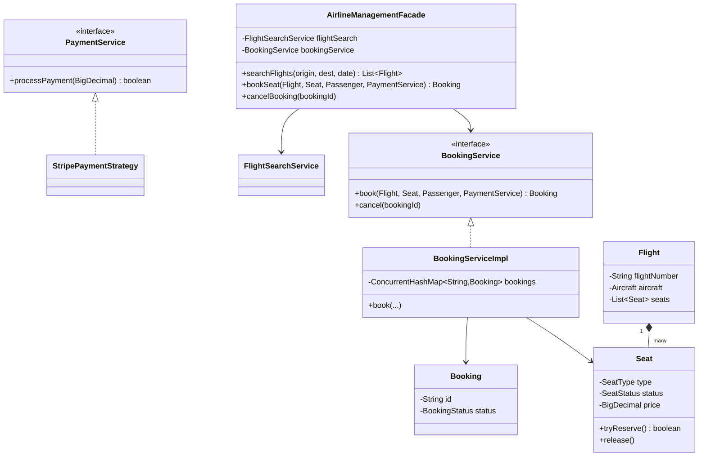

# ✈️ Airline Management System — SDE3 Upgraded

## Overview
A flight booking platform modelling seat reservation, payment processing, and flight search for an airline like IndiGo or Emirates. Resolves the classic TOCTOU seat-booking race and replaces hardcoded payment coupling with a Strategy pattern.

## SDE3 Upgrades Applied

| Issue | Fix |
|-------|-----|
| `seat.isAvailable()` + `seat.reserve()` — TOCTOU race allows double-booking | `synchronized seat.tryReserve()` returns boolean — atomic check-and-set |
| Global `BookingManager` Singleton blocks all concurrent bookings | Stateless `BookingServiceImpl` with `ConcurrentHashMap` — no global lock |
| `StripePaymentService` hardcoded | `PaymentService` interface → `StripePaymentStrategy`, swappable at DI time |
| `double price` on seats | `BigDecimal` throughout |

## Class Diagram



## Run
```bash
javac $(find airlinemanagementsystem_upgraded -name "*.java")
java airlinemanagementsystem_upgraded.AirlineManagementSystemDemoUpgraded
```
