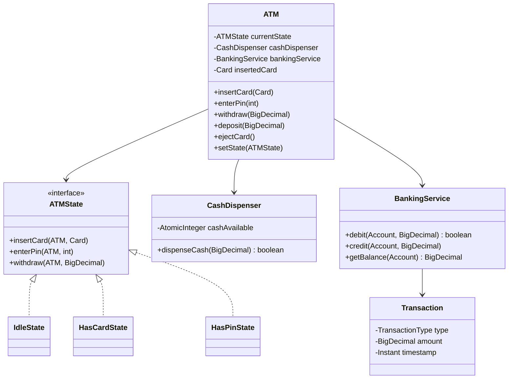

# 🏧 ATM — SDE3 Upgraded

## Overview
An ATM system modelling card insertion, PIN validation, balance enquiry, withdrawal, and deposit. Implements the GoF State Pattern for hardware lifecycle management and a Two-Phase Commit Saga to coordinate bank ledger updates with cash dispenser atomically.

## SDE3 Upgrades Applied

| Issue | Fix |
|-------|-----|
| `if/else` status checks — illegal operations reachable (withdraw before PIN entry) | GoF State Machine: `IdleState → HasCardState → HasPinState → SelectionState` |
| `double` account balance — IEEE 754 cents errors | `BigDecimal` with `HALF_UP` rounding for all monetary values |
| Bank debit + cash dispense not coordinated — partial failures possible | Two-Phase Commit Saga with compensating transaction (re-credit) if dispenser fails |

## Class Diagram



## Run
```bash
javac $(find atm_upgraded -name "*.java")
java atm_upgraded.ATMDemoUpgraded
```
