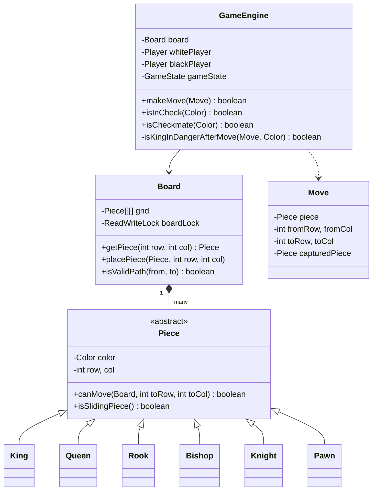

# ♟️ Chess Game — SDE3 Upgraded

## Overview
A two-player chess engine with decoupled board state and rules logic. The `GameEngine` handles move validation, ray-casting path obstruction detection for sliding pieces, and check/checkmate detection via mathematical rollback without modifying the live board.

## SDE3 Upgrades Applied

| Issue | Fix |
|-------|-----|
| Board class contained both state AND rules — God Object | Board manages 2D state only; `GameEngine` owns all rules, validation, and check logic |
| Piece movement checked without verifying path obstruction | Ray-casting in `Board.isValidPath()` detects blocking pieces for Rooks, Bishops, Queens |
| Checkmate detection required full board copy | Simulated king-move rollback: apply → test → unapply without a clone |

## Class Diagram



## Run
```bash
javac $(find chessgame_upgraded -name "*.java")
java chessgame_upgraded.ChessGameDemoUpgraded
```
