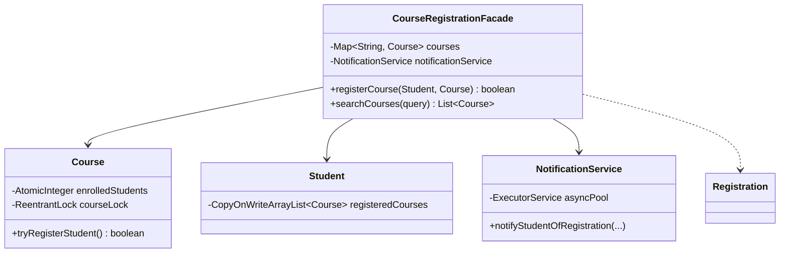

# 🎓 University Course Registration System — SDE3 Upgraded

## Overview
A university course enrollment system where students search for classes and register before capacity runs out. The core challenge is dealing with the "flash rush" (thousands of students hitting registration simultaneously) without resorting to a catastrophic global lock.

## SDE3 Upgrades Applied

| Issue | Fix |
|-------|-----|
| Global `synchronized registerCourse(student, course)` blocks everyone | Sharded concurrency: Added an explicit `ReentrantLock` directly into the `Course` POJO. Registration is fully concurrent across different courses. |
| TOCTOU Race Condition on capacity checking | Inside `Course.tryRegisterStudent()`, the lock bridges the capacity check (`current < maxCapacity`) and atomic increment (`enrolledStudents.incrementAndGet()`). |
| Linear O(N) sequence for `searchCourses` | Migrated to `courses.values().parallelStream().filter(...)` utilizing multi-core indexing for vast course catalogs. |
| Synchronous UI Notification on Registration | Dispatched `NotificationService` to a background `ExecutorService` thread pool, generating asynchronous email/event triggers. |

## Class Diagram



## Run
```bash
javac $(find courseregistrationsystem_upgraded -name "*.java")
java courseregistrationsystem_upgraded.CourseRegistrationDemoUpgraded
```
