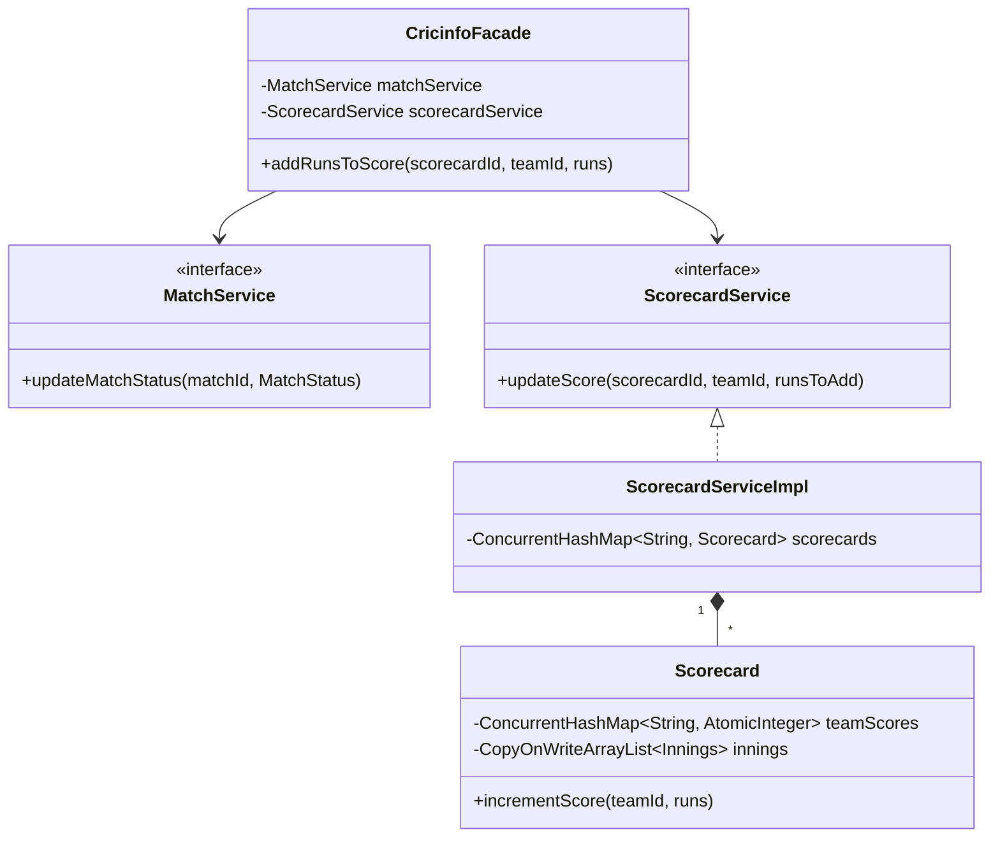

# 🏏 CricInfo (Live Cricket Score) System — SDE3 Upgraded

## Overview
A live cricket match tracking system modeling innings, overs, balls, and scorecards. The primary challenge is handling concurrent, high-frequency ball-by-ball score updates from multiple data feeds without losing score counts or triggering concurrency exceptions.

## SDE3 Upgrades Applied

| Issue | Fix |
|-------|-----|
| `HashMap<String, Integer>` mutating under load | `ConcurrentHashMap` combined with `AtomicInteger` to ensure thread-safe score accumulation (`addAndGet()`). |
| `ArrayList` throwing `ConcurrentModificationException` during iteration | `CopyOnWriteArrayList` implemented for Innings and Over arrays, guaranteeing safe reads while the match is mutating. |
| Global Singletons (`ScorecardService.getInstance()`) | Removed Singletons; built an orchestrated `CricinfoFacade` utilizing Dependency Injection. |

## Class Diagram



## Run
```bash
javac $(find cricinfo_upgraded -name "*.java")
java cricinfo_upgraded.CricinfoDemoUpgraded
```
