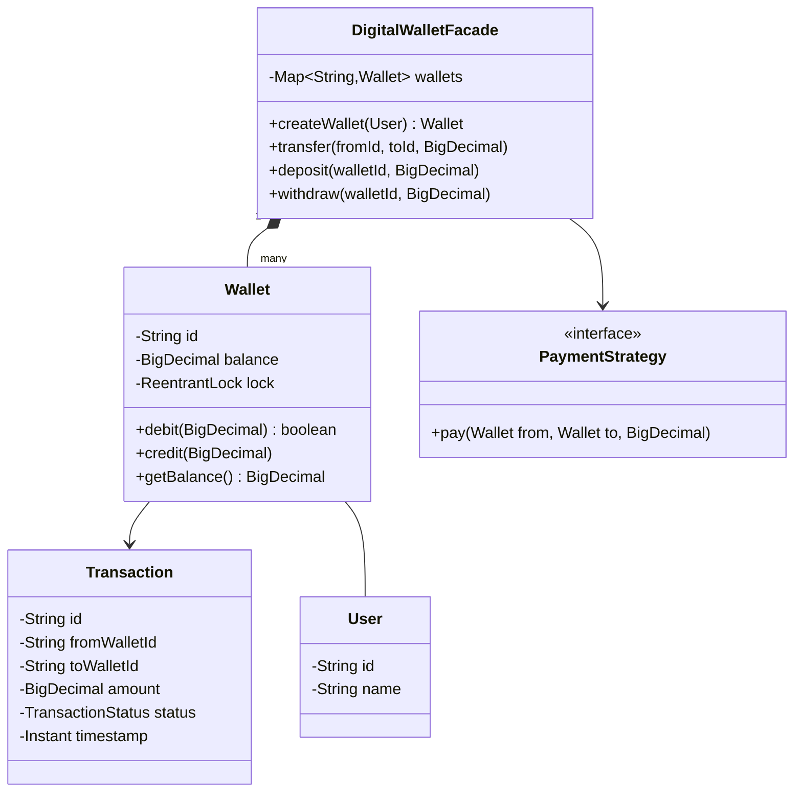

# 💳 Digital Wallet — SDE3 Upgraded

## Overview
A peer-to-peer digital wallet modelling UPI/PayPal-style fund transfers. Eliminates deadlocks in concurrent two-party transfers using strict lock ordering, and uses BigDecimal for financial precision.

## SDE3 Upgrades Applied

| Issue | Fix |
|-------|-----|
| Risk of deadlock when User A→B and User B→A transfer simultaneously | Lexicographic wallet ID ordering enforces a deterministic lock acquisition sequence |
| `double` balance fields | `BigDecimal` with `HALF_UP` rounding |
| Single global transfer lock — all transfers serialize | Per-Wallet `ReentrantLock`; only involved wallets are locked |

## Class Diagram



## Run
```bash
javac $(find digitalwallet_upgraded -name "*.java")
java digitalwallet_upgraded.DigitalWalletDemoUpgraded
```
