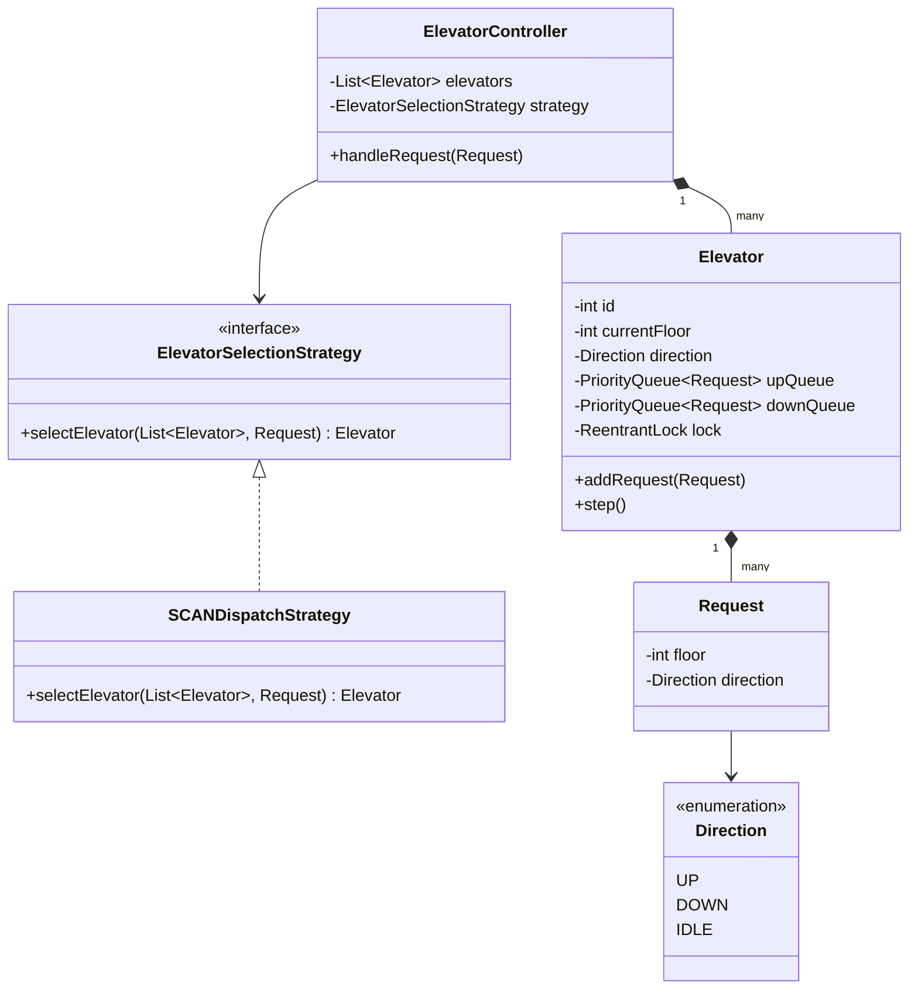

# 🛗 Elevator System — SDE3 Upgraded

## Overview
A multi-elevator dispatch system for a building. Implements the SCAN algorithm (disk scheduling analogy) via a `PriorityQueue` to efficiently serve floor requests in direction-sorted order, minimising average wait time.

## SDE3 Upgrades Applied

| Issue | Fix |
|-------|-----|
| Round-robin assignment ignores proximity — inefficient | `SCANDispatchStrategy`: selects nearest elevator moving in the right direction |
| Single `synchronized` on the controller — blocks all elevators | Per-`Elevator` `ReentrantLock`; controller only coordinates, not bottlenecks |
| No strategy abstraction for dispatch | `ElevatorSelectionStrategy` interface — injectable at runtime |

## Class Diagram



## Run
```bash
javac $(find elevatorsystem_upgraded -name "*.java")
java elevatorsystem_upgraded.ElevatorSystemDemoUpgraded
```
