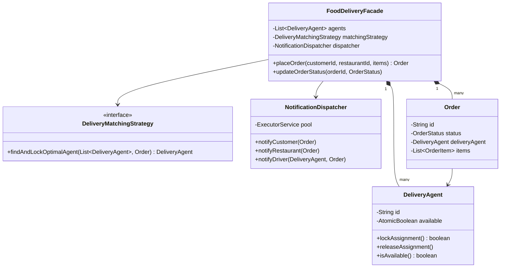

# 🍕 Food Delivery Service — SDE3 Upgraded

## Overview
An online food delivery platform modelling Swiggy/DoorDash order placement, driver assignment, and asynchronous notifications to customers, restaurants, and drivers.

## SDE3 Upgrades Applied

| Issue | Fix |
|-------|-----|
| `if (agent.isAvailable()) { agent.setAvailable(false) }` — TOCTOU race causes two orders to claim the same driver | `AtomicBoolean.compareAndSet(true, false)` — CPU-level CAS, exactly one caller succeeds |
| SMS/push notifications block the order confirmation thread | `NotificationDispatcher` backed by `ExecutorService` — fire-and-forget |
| Hardcoded `for` loop iterating agents | `DeliveryMatchingStrategy` interface — DI-injectable search algorithm |

## Class Diagram



## Run
```bash
javac $(find fooddeliveryservice_upgraded -name "*.java")
java fooddeliveryservice_upgraded.FoodDeliveryServiceDemoUpgraded
```
