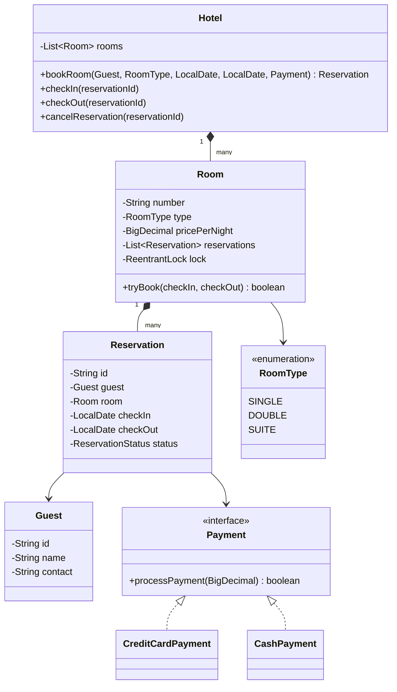

# 🏨 Hotel Management System — SDE3 Upgraded

## Overview
A hotel room reservation platform handling concurrent bookings, check-in/check-out, and multi-method payment. The SDE3 upgrade introduces interval bounding to prevent overlapping reservations — the core correctness bug in the original.

## SDE3 Upgrades Applied

| Issue | Fix |
|-------|-----|
| Two guests can book the same room for overlapping dates simultaneously | Per-Room `ReentrantLock` + date-overlap check inside critical section |
| `double` for room pricing | `BigDecimal` with `RoundingMode.HALF_UP` |
| Single payment method hardcoded | `Payment` interface → `CreditCardPayment`, `CashPayment` strategies |

## Class Diagram



## Run
```bash
javac $(find hotelmanagement_upgraded -name "*.java")
java hotelmanagement_upgraded.HotelManagementSystemDemoUpgraded
```
