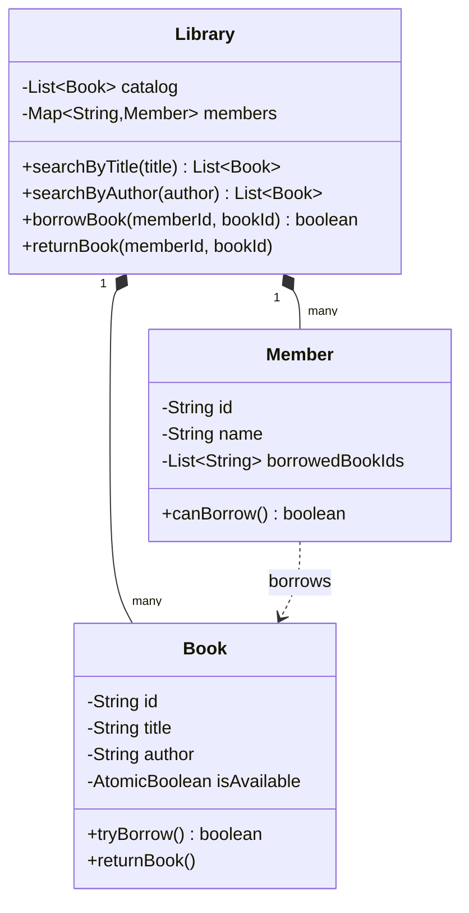

# 📚 Library Management System — SDE3 Upgraded

## Overview
A library catalog and lending system managing books, members, and borrow/return operations. The SDE3 upgrade replaces a global borrow lock with per-book `AtomicBoolean` micro-locks and switches catalog searches to run on a parallel stream.

## SDE3 Upgrades Applied

| Issue | Fix |
|-------|-----|
| Global `synchronized(this)` on all borrow operations — no parallelism | Per-`Book` `AtomicBoolean isAvailable` with `compareAndSet` |
| O(N) linear catalog search in request thread | `parallelStream().filter()` leverages all CPU cores |
| Member borrow count unchecked | Explicit borrow limit enforced before CAS attempt |

## Class Diagram



## Run
```bash
javac $(find librarymanagementsystem_upgraded -name "*.java")
java librarymanagementsystem_upgraded.LibraryManagementSystemDemoUpgraded
```
