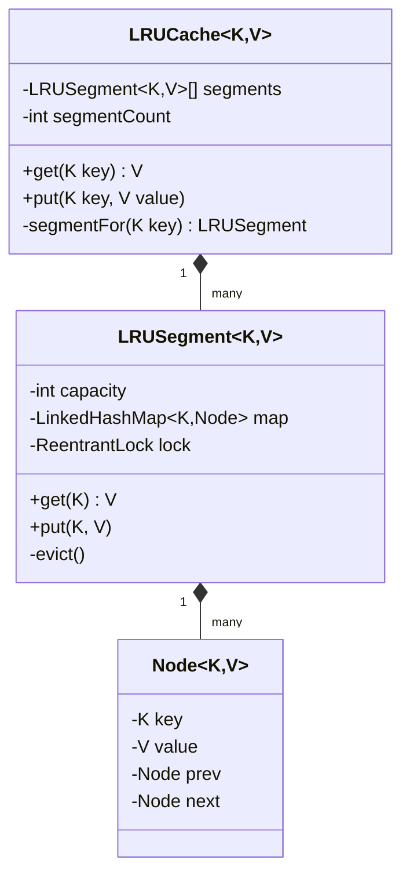

# ⚡ LRU Cache — SDE3 Upgraded

## Overview
A fixed-capacity Least Recently Used cache with lock-striped concurrency. Instead of a global `synchronized` block, the cache is partitioned into independent segments — each with its own `ReentrantLock` — allowing parallel access across different key ranges.

## SDE3 Upgrades Applied

| Issue | Fix |
|-------|-----|
| `synchronized` on the whole cache — all threads serialize | Lock-striped segments via `LRUSegment[]`; threads on different keys never contend |
| Capacity eviction under global lock | Each `LRUSegment` independently manages its own doubly-linked list + capacity |
| No thread-safe iteration | `ReadWriteLock` per segment — readers share, writers are exclusive |

## Class Diagram



## Run
```bash
javac $(find lrucache_upgraded -name "*.java")
java lrucache_upgraded.LRUCacheDemoUpgraded
```
