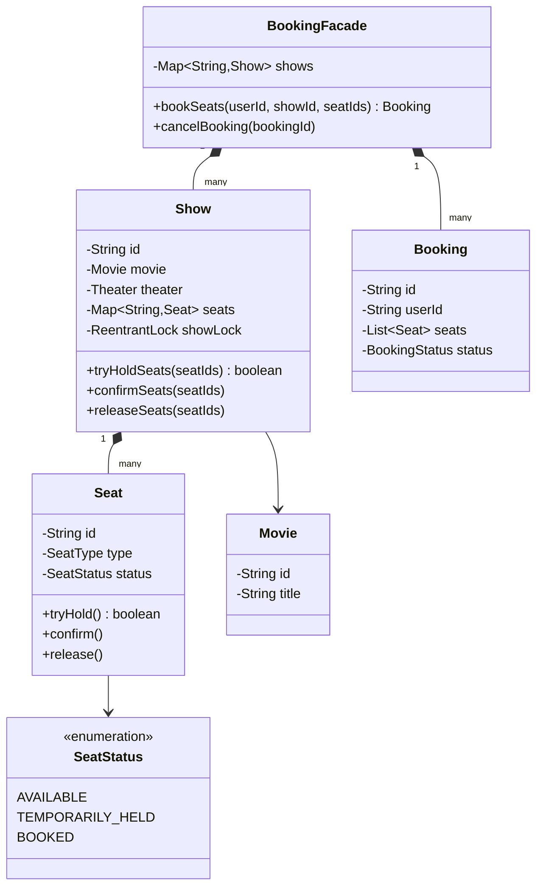

# 🎬 Movie Ticket Booking System — SDE3 Upgraded

## Overview
A cinema seat reservation system handling concurrent bookings across multiple shows. Introduces a `TEMPORARILY_HELD` intermediate seat state and per-show locking to eliminate the classic double-booking race.

## SDE3 Upgrades Applied

| Issue | Fix |
|-------|-----|
| Global lock — all shows serialize on one monitor | Per-`Show` `ReentrantLock`; parallel bookings on different shows contend only on the same show |
| AVAILABLE → BOOKED in two steps — TOCTOU window | Atomic AVAILABLE → TEMPORARILY_HELD → BOOKED three-phase commit inside lock |
| `SeatStatus` mutated without holding any lock | `synchronized seat.tryHold()` and `seat.confirm()` |

## Class Diagram



## Run
```bash
javac $(find movieticketbookingsystem_upgraded -name "*.java")
java movieticketbookingsystem_upgraded.MovieTicketBookingDemoUpgraded
```
