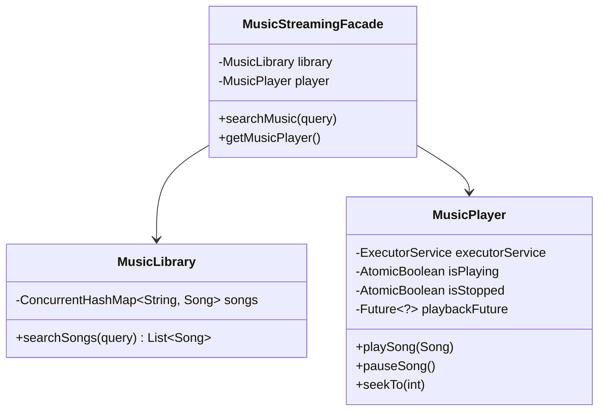

# 🎵 Music Streaming Service — SDE3 Upgraded

## Overview
A Spotify-like audio streaming backend managing massive music libraries, user playlists, and actual music playback capabilities. The focus is cleanly managing long-running playback state engines.

## SDE3 Upgrades Applied

| Issue | Fix |
|-------|-----|
| Raw `new Thread(() -> play()).start()` causing rogue execution leaks | Instantiated a dedicated `ExecutorService` backing the `MusicPlayer`, returning `Future<?>` tokens to explicitly manage execution lifecycles. |
| Busy-Spinning or Thread Death on Pause | Utilized `AtomicBoolean` switches (`isPlaying`, `isStopped`) allowing clean pausing, resuming, and seeking without terminating the core executor queue. |
| Massive catalog string searching | Catalog inverted to `parallelStream` filtering for instantaneous O(N/cores) performance over titles, albums, and artists simultaneously. |

## Class Diagram



## Run
```bash
javac $(find musicstreamingservice_upgraded -name "*.java")
java musicstreamingservice_upgraded.MusicStreamingServiceDemoUpgraded
```
