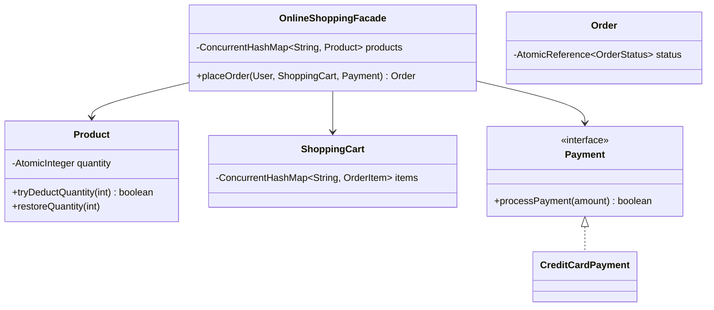

# 🛒 Online Shopping System — SDE3 Upgraded

## Overview
An Amazon-style E-Commerce backend modeling catalogs, shopping carts, and a strict checkout payment gateway. The extreme difficulty lies in maintaining absolute transactional integrity (Inventory Deductions vs Payment Success) without over-selling or deadlocking the catalog.

## SDE3 Upgrades Applied

| Issue | Fix |
|-------|-----|
| TOCTOU `Product.isAvailable()` followed blindly by `updateQuantity(-qty)` | Fused into a singular atomic Compare-And-Swap (CAS) `tryDeductQuantity()` using an `AtomicInteger`. |
| Dropped Carts & Payment Gateway Failures leaking out-of-stock items | Built a true **Saga Orchestrator**. If an order deducts 4 items but fails on the 5th (OOS), or deducts all 5 but the Credit Card fails, the Saga automatically fires a **Compensating Transaction** `product.restoreQuantity()` rolling the inventory cleanly back to initial bounds. |

## Class Diagram



## Run
```bash
javac $(find onlineshopping_upgraded -name "*.java")
java onlineshopping_upgraded.OnlineShoppingServiceDemoUpgraded
```
