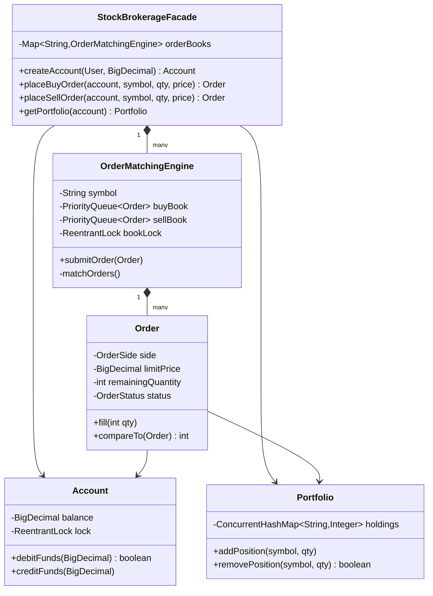

# 📈 Online Stock Brokerage System — SDE3 Upgraded

## Overview
An NYSE-style stock exchange platform with limit order submission and a price-time priority matching engine. The core upgrade introduces a dual-PriorityQueue Order Book — the fundamental data structure powering every real exchange from NASDAQ to Binance.

## SDE3 Upgrades Applied

| Issue | Fix |
|-------|-----|
| `BuyOrder.execute()` creates shares out of thin air — no counter-party | `OrderMatchingEngine` matches bids against asks; trades only settle when both sides agree |
| `double` price fields — IEEE 754 floating-point errors in cent calculations | `BigDecimal` with `RoundingMode.HALF_UP` throughout |
| Single global `StockBroker` Singleton | `StockBrokerageFacade` with one `OrderMatchingEngine` per symbol via `ConcurrentHashMap` |

## Class Diagram



## Run
```bash
javac $(find onlinestockbrokeragesystem_upgraded -name "*.java")
java onlinestockbrokeragesystem_upgraded.StockBrokerageDemoUpgraded
```
