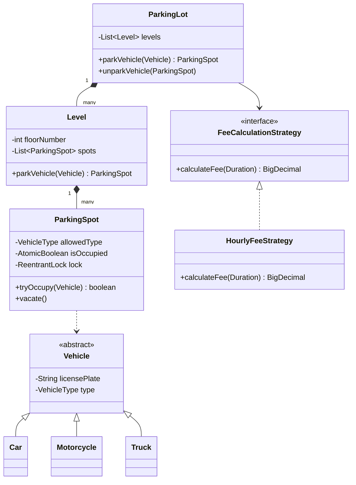

# 🅿️ Parking Lot — SDE3 Upgraded

## Overview
A thread-safe, multi-level parking lot system handling concurrent vehicle entry/exit without overbooking spots. Models real-world parking infrastructure with pluggable fee calculation.

## SDE3 Upgrades Applied

| Issue | Fix |
|-------|-----|
| Global synchronized lock — all vehicles serialize on one monitor | Per-spot `ReentrantLock` allowing parallel occupancy on different spots |
| Hardcoded flat fee | `FeeCalculationStrategy` interface — swap `HourlyFeeStrategy`, `FlatFeeStrategy` at runtime |
| Primitive `boolean available` on ParkingSpot | `AtomicBoolean` with `tryLock()` for contention-free CAS claim |

## Class Diagram



## Run
```bash
javac $(find parkinglot_upgraded -name "*.java")
java parkinglot_upgraded.ParkingLotDemoUpgraded
```
