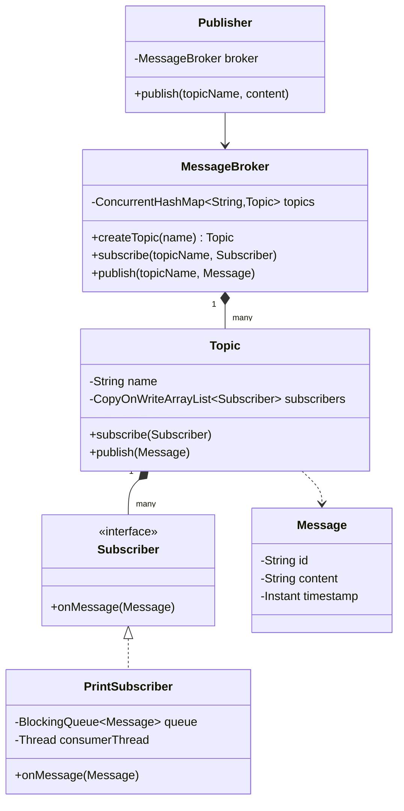

# 📡 Pub/Sub System — SDE3 Upgraded

## Overview
An in-memory publish-subscribe message broker modelling Kafka/SNS semantics. Topics route messages to isolated subscriber queues, enabling true async fan-out without blocking the publisher.

## SDE3 Upgrades Applied

| Issue | Fix |
|-------|-----|
| Synchronous subscriber callbacks block the publisher thread | Each subscriber gets a dedicated `BlockingQueue<Message>` + consumer `Thread` |
| Shared collection modified while iterating over subscribers | `CopyOnWriteArrayList` for subscriber registry on each `Topic` |
| All messages go to all subscribers — no isolation | Per-topic, per-subscriber queues; slow consumers don't affect others |

## Class Diagram



## Run
```bash
javac $(find pubsubsystem_upgraded -name "*.java")
java pubsubsystem_upgraded.PubSubSystemDemoUpgraded
```
