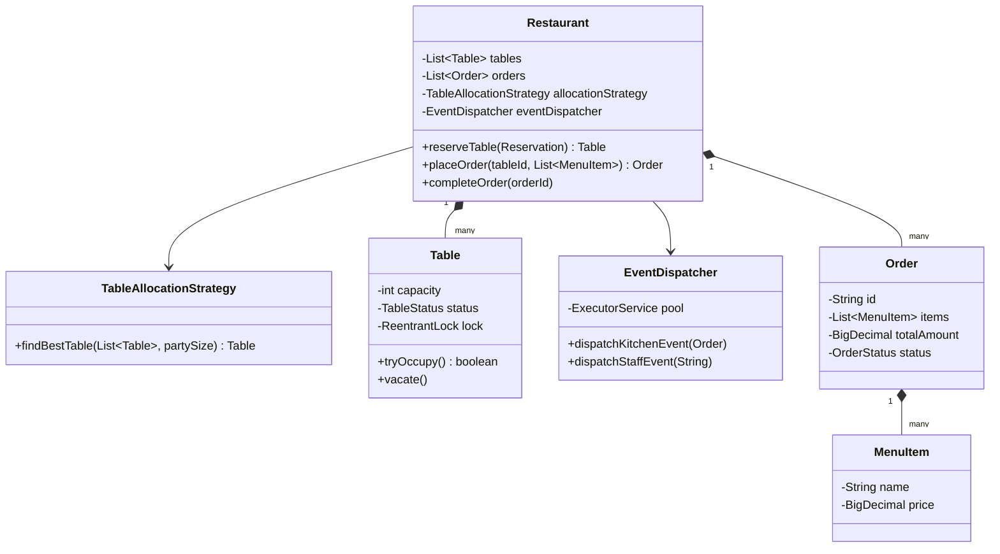

# 🍽️ Restaurant Management System — SDE3 Upgraded

## Overview
A restaurant operations system managing table reservations, order placement, and kitchen notifications. The SDE3 upgrade introduces an async `EventDispatcher` to decouple kitchen/staff pings from the main order flow, and a `TableAllocationStrategy` for optimal seat assignment.

## SDE3 Upgrades Applied

| Issue | Fix |
|-------|-----|
| Kitchen notification called inline — blocks the response to the waiter | `EventDispatcher` backed by `ExecutorService` — fires asynchronously |
| First available table assigned regardless of fit | `TableAllocationStrategy`: selects tightest-fit capacity to reduce waste |
| Table state flipped without a lock — two reservations can claim the same table | Per-`Table` `ReentrantLock` inside allocation strategy |

## Class Diagram



## Run
```bash
javac $(find restaurantmanagementsystem_upgraded -name "*.java")
java restaurantmanagementsystem_upgraded.RestaurantManagementDemoUpgraded
```
