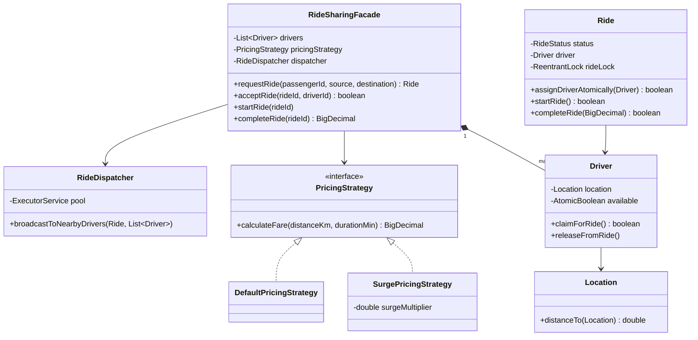

# 🚗 Ride Sharing Service — SDE3 Upgraded

## Overview
An Uber-style ride-hailing system with passenger ride requests, proximity-based driver notification, atomic ride acceptance, and pluggable surge pricing. Eliminates the core multi-driver double-acceptance race condition via a two-layer locking protocol.

## SDE3 Upgrades Applied

| Issue | Fix |
|-------|-----|
| `if (ride.getStatus() == REQUESTED) ride.setDriver(...)` — multiple driver threads pass and all get assigned | Per-`Ride` `ReentrantLock` + Driver `AtomicBoolean.compareAndSet()` — exactly one thread succeeds |
| `Math.random()` distance approximation | Haversine formula on real lat/lon coordinates |
| Hardcoded fare = `distance * flatRate` | `PricingStrategy` interface → `DefaultPricingStrategy`, `SurgePricingStrategy` — injectable |
| O(N) distance sweep on the request thread | `RideDispatcher` with `ExecutorService` broadcasts to nearby drivers asynchronously |

## Class Diagram



## Run
```bash
javac $(find ridesharingservice_upgraded -name "*.java")
java ridesharingservice_upgraded.RideSharingDemoUpgraded
```
