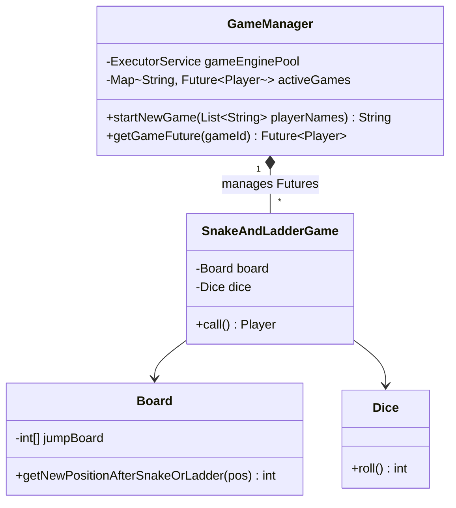

# 🐍 Snake & Ladder Game — SDE3 Upgraded

## Overview
A backend engine for the classic board game, capable of simulating completely automated match lifecycles across an arbitrary number of human or bot opponents. The core focus here is scaling execution capabilities to host millions of active game instances.

## SDE3 Upgrades Applied

| Issue | Fix |
|-------|-----|
| O(N) linear list searches for matching snake heads on every single dice roll | Pre-compiled the board graph into a scalar integer array `int[] jumpBoard = new int[101]`. Testing for a snake/ladder is now a strictly O(1) memory mapping (e.g., `return jumpBoard[16] == 0 ? pos : jumpBoard[16]`). |
| Unmanaged garbage threads (`new Thread().start()`) over populating OS | Re-designated the game class as a `Callable<Player>`, dispatching iterations into a scalable CPU-bounded `ExecutorService` thread pool. |
| Orphaned game loops | `GameManager` now houses `ConcurrentHashMap<String, Future<Player>>`, meaning system architects can monitor progress, fetch the winner securely via `.get()`, or force-terminate dangling games automatically. |

## Class Diagram



## Run
```bash
javac $(find snakeandladdergame_upgraded -name "*.java")
java snakeandladdergame_upgraded.SnakeAndLadderDemoUpgraded
```
