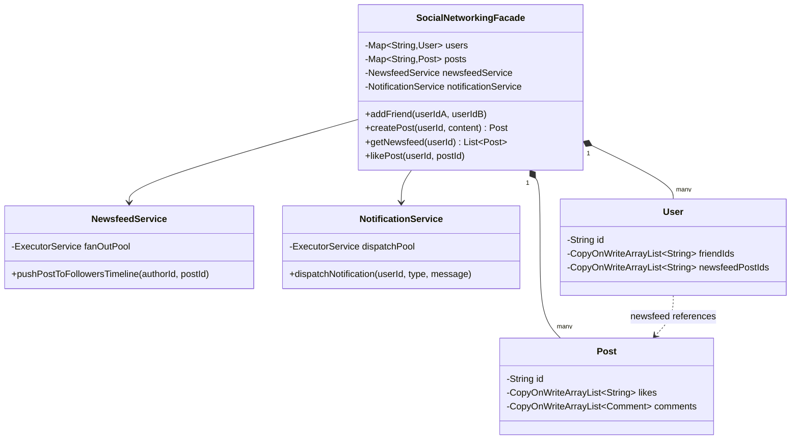

# 👥 Social Networking Service — SDE3 Upgraded

## Overview
A Facebook/Instagram-style social platform with user connections, post creation, newsfeed generation, and likes/comments. The SDE3 upgrade replaces the catastrophically slow O(N×M) pull-model feed with a Fan-Out-On-Write push architecture.

## SDE3 Upgrades Applied

| Issue | Fix |
|-------|-----|
| `getNewsfeed()` traverses every friend's post list at read time — O(N×M) | `NewsfeedService` fans post IDs into each friend's pre-computed `newsfeedPostIds` list asynchronously — O(1) feed reads |
| `ArrayList<String> likes` throws `ConcurrentModificationException` under viral load | `CopyOnWriteArrayList` for likes, comments, and friend lists |
| Monolithic service | Split into `SocialNetworkingFacade`, `NewsfeedService`, `NotificationService` |

## Class Diagram



## Run
```bash
javac $(find socialnetworkingservice_upgraded -name "*.java")
java socialnetworkingservice_upgraded.SocialNetworkingDemoUpgraded
```
