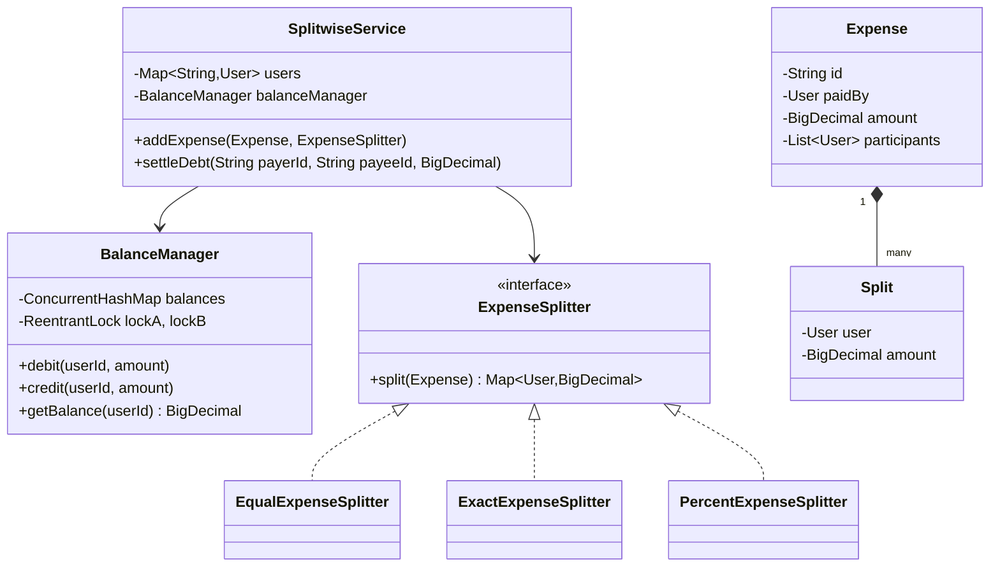

# 💸 Splitwise — SDE3 Upgraded

## Overview
A multi-party expense splitting system supporting equal, exact, and percentage splits. Models Splitwise's core debt settlement engine with deadlock-safe concurrent balance updates.

## SDE3 Upgrades Applied

| Issue | Fix |
|-------|-----|
| Unguarded balance modifications — concurrent updates corrupt totals | Lexicographic `ReentrantLock` ordering on two-user pairs eliminates circular deadlocks |
| Hardcoded equal split only | `ExpenseSplitter` Strategy interface with `EqualExpenseSplitter`, `ExactExpenseSplitter`, `PercentExpenseSplitter` |
| Raw `double` balances | `BigDecimal` with `RoundingMode.HALF_UP` throughout |

## Class Diagram



## Run
```bash
javac $(find splitwise_upgraded -name "*.java")
java splitwise_upgraded.SplitwiseDemoUpgraded
```
