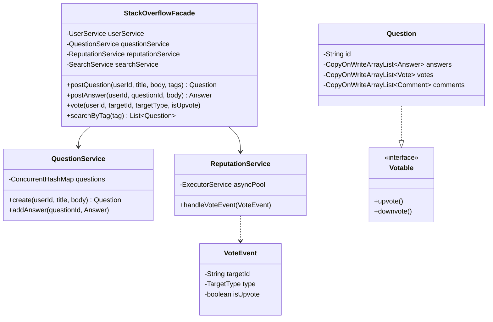

# 🌐 Stack Overflow — SDE3 Upgraded

## Overview
A Q&A platform modelling question/answer posting, voting, commenting, and reputation scoring. The SDE3 upgrade introduces Domain-Driven Design, decoupled services, and an asynchronous reputation pipeline via events.

## SDE3 Upgrades Applied

| Issue | Fix |
|-------|-----|
| Monolithic `StackOverflow` class mutates reputation inline — blocks request thread | `VoteEvent` published asynchronously; `ReputationService` processes off the hot path |
| `ConcurrentModificationException` on votes/comments under load | `CopyOnWriteArrayList` for votes and comments collections |
| God-class with all logic | Split into `UserService`, `QuestionService`, `ReputationService`, `SearchService` |

## Class Diagram



## Run
```bash
javac $(find stackoverflow_upgraded -name "*.java")
java stackoverflow_upgraded.StackOverflowDemoUpgraded
```
