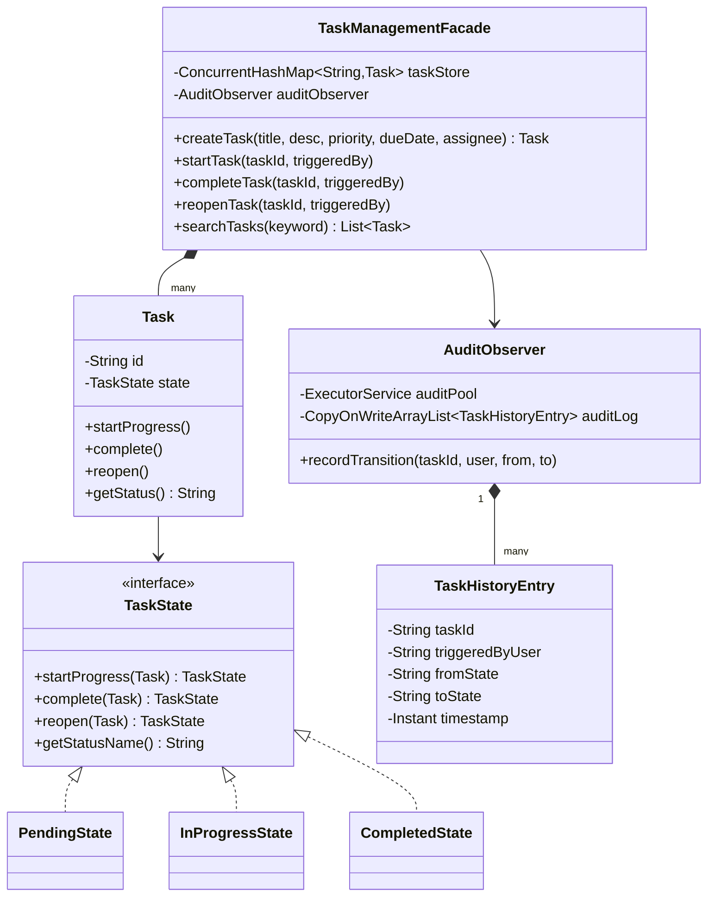

# ✅ Task Management System (Jira) — SDE3 Upgraded

## Overview
A Jira-style task lifecycle management system supporting task creation, state transitions, assignment, and full audit logging. The GoF State Pattern makes illegal transitions (e.g., COMPLETED → IN_PROGRESS without reopening) structurally impossible rather than guarded by conditionals.

## SDE3 Upgrades Applied

| Issue | Fix |
|-------|-----|
| Any code can call `task.setStatus(COMPLETED)` from any state | `PendingState`, `InProgressState`, `CompletedState` concrete objects — invalid transitions throw `IllegalStateException` |
| No record of who changed what and when | `AuditObserver` with `ExecutorService` fires immutable `TaskHistoryEntry` events asynchronously |
| O(N) linear `for` loop in `searchTasks` | `parallelStream().filter()` using all CPU cores |

## Class Diagram



## Run
```bash
javac $(find taskmanagementsystem_upgraded -name "*.java")
java taskmanagementsystem_upgraded.TaskManagementDemoUpgraded
```
