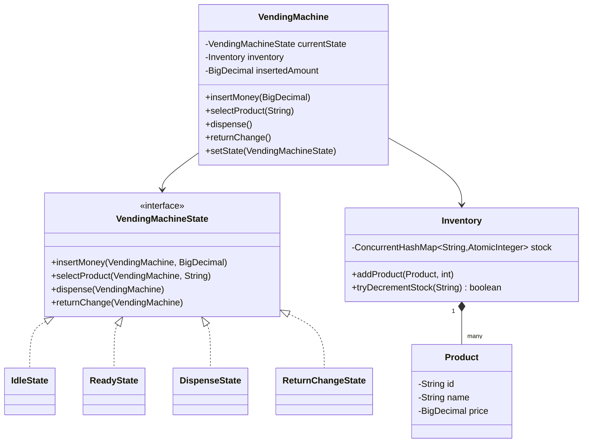

# 🥤 Vending Machine — SDE3 Upgraded

## Overview
A vending machine modelling cash payment, inventory tracking, and change dispensing. Implements the GoF State Pattern to make illegal transitions (e.g., dispensing before payment) structurally impossible.

## SDE3 Upgrades Applied

| Issue | Fix |
|-------|-----|
| `if/else` chains on a status enum — illegal states reachable | GoF State Pattern: `IdleState`, `ReadyState`, `DispenseState`, `ReturnChangeState` |
| `int` quantity in Inventory — concurrent restock races | `ConcurrentHashMap` + `AtomicInteger` quantities |
| `double` price comparisons | `BigDecimal` for precise cash/change arithmetic |

## Class Diagram



## Run
```bash
javac $(find vendingmachine_upgraded -name "*.java")
java vendingmachine_upgraded.VendingMachineDemoUpgraded
```
